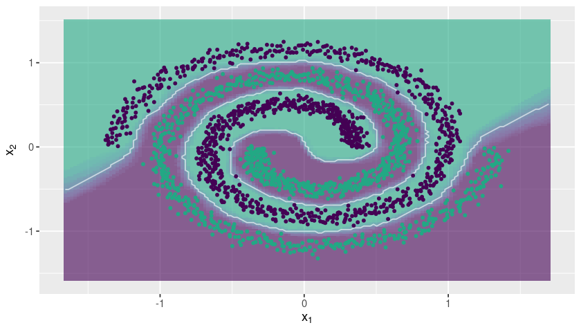
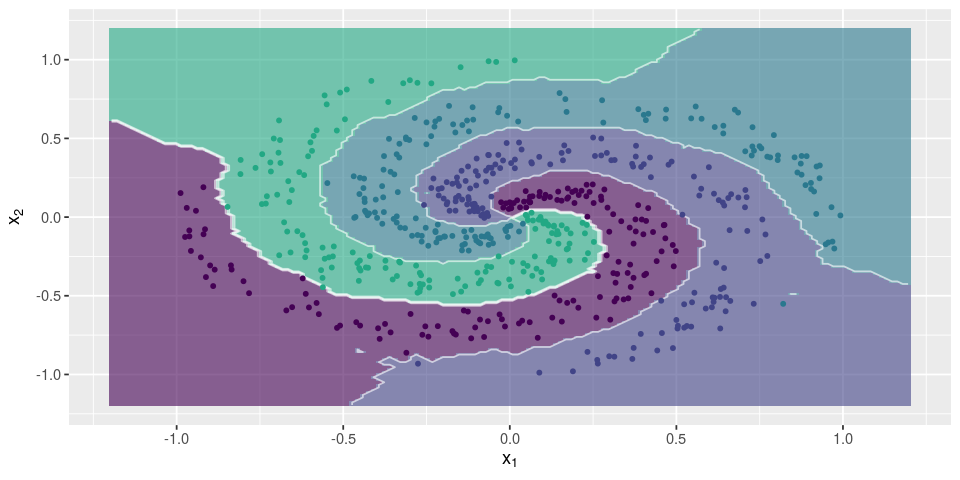
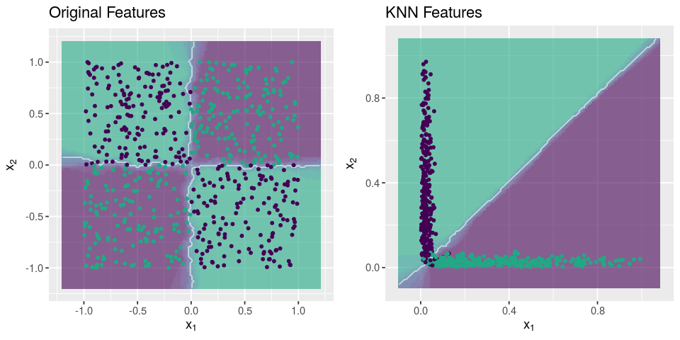
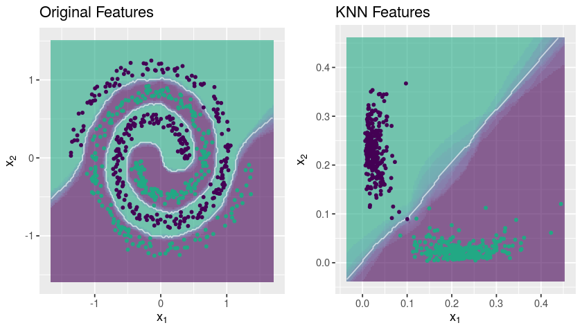

Fast k-Nearest Neighbor Classifier
================

> Fast KNN with shrinkage estimator for the class membership probabilities

[](https://travis-ci.org/davpinto/fastknn) [](https://cran.r-project.org/package=fastknn)

------------------------------------------------------------------------

The `fastknn` in now available on [Kaggle](https://github.com/Kaggle/docker-rstats). Take a look at this [kernel](https://www.kaggle.com/davidpinto/d/uciml/forest-cover-type-dataset/fastknn-show-to-glm-what-knn-see-0-96) to see an example on how to use `fastknn` to improve your performance on **Kaggle** competitions.

------------------------------------------------------------------------

### Why `fastknn`?

1.  Build KNN classifiers with **large datasets** (&gt; 100k rows) in a few seconds.
2.  Predict more **calibrated probabilities** and reduce log-loss with the `"dist"` estimator.
3.  Find the **best k** parameter according to a variety of loss functions, using n-fold cross validation.
4.  Plot beautiful classification **decision boundaries** for your dataset.
5.  Do **feature engineering** and extract high informative features from your dataset.
6.  Compete in **Kaggle**.

Give it a try and let me know what you think!

Fast Nearest Neighbor Searching
-------------------------------

The `fastknn` method implements a k-Nearest Neighbor (KNN) classifier based on the [ANN](https://www.cs.umd.edu/~mount/ANN) library. ANN is written in `C++` and is able to find the k nearest neighbors for every point in a given dataset in `O(N log N)` time. The package [RANN](https://github.com/jefferis/RANN) provides an easy interface to use ANN library in `R`.

The FastKNN Classifier
----------------------

The `fastknn` was developed to deal with very large datasets (&gt; 100k rows) and is ideal to [Kaggle](https://www.kaggle.com) competitions. It can be about 50x faster then the popular `knn` method from the `R` package [class](https://cran.r-project.org/web/packages/class), for large datasets. Moreover, `fastknn` provides a shrinkage estimator to the class membership probabilities, based on the inverse distances of the nearest neighbors (see the equations on [fastknn website](https://davpinto.github.io/fastknn/)):

$$
P(x\_i \\in y\_j) = \\displaystyle\\frac{\\displaystyle\\sum\\limits\_{k=1}^K \\left( \\frac{1}{d\_{ik}}\\cdot(n\_{ik} \\in y\_j) \\right)}{\\displaystyle\\sum\\limits\_{k=1}^K \\left( \\frac{1}{d\_{ik}} \\right)}
$$

where *x*<sub>*i*</sub> is the *i*<sup>th</sup> test instance, *y*<sub>*j*</sub> is the *j*<sup>th</sup> unique class label, *n*<sub>*i**k*</sub> is the *k*<sup>th</sup> nearest neighbor of *x*<sub>*i*</sub>, and *d*<sub>*i**k*</sub> is the distance between *x*<sub>*i*</sub> and *n*<sub>*i**k*</sub>. This estimator can be thought of as a weighted voting rule, where those neighbors that are more close to *x*<sub>*i*</sub> will have more influence on predicting *x*<sub>*i*</sub>'s label.

In general, the weighted estimator provides more **calibrated probabilities** when compared with the traditional estimator based on the label proportions of the nearest neighbors, and reduces **logarithmic loss** (log-loss).

### How to install `fastknn`?

The package `fastknn` is not on CRAN, so you need to install it directly from GitHub:

``` r
library("devtools")
install_github("davpinto/fastknn")
```

### Required Packages

The base of `fastknn` is the `RANN` package, but other packages are required to make `fastknn` work properly. All of them are automatically installed when you install the `fastknn`.

-   `RANN` for fast nearest neighbors searching,
-   `foreach` and `doSNOW` to do parallelized cross-validation,
-   `Metrics` to measure classification performance,
-   `matrixStats` for fast matrix column-wise and row-wise statistics,
-   `ggplot2` to plot classification decision boundaries,
-   `viridis` for modern color palletes.

### Getting Started

Using `fastknn` is as simple as:

``` r
## Load packages
library("fastknn")
library("caTools")

## Load toy data
data("chess", package = "fastknn")

## Split data for training and test
set.seed(123)
tr.idx <- which(caTools::sample.split(Y = chess$y, SplitRatio = 0.7))
x.tr   <- chess$x[tr.idx, ]
x.te   <- chess$x[-tr.idx, ]
y.tr   <- chess$y[tr.idx]
y.te   <- chess$y[-tr.idx]

## Fit KNN
yhat <- fastknn(x.tr, y.tr, x.te, k = 10)

## Evaluate model on test set
sprintf("Accuracy: %.2f", 100 * (1 - classLoss(actual = y.te, predicted = yhat$class)))
```

    ## [1] "Accuracy: 97.67"

Find the Best k
---------------

The `fastknn` provides a interface to select the best `k` using n-fold cross-validation. There are 4 possible **loss functions**:

-   Overall classification error rate: `eval.metric = "overall_error"`
-   Mean per-class classification error rate: `eval.metric = "mean_error"`
-   Mean per-class AUC: `eval.metric = "auc"`
-   Cross-entropy / logarithmic loss: `eval.metric = "logloss"`

Cross-validation using the **voting** probability estimator:

``` r
## Load dataset
library("mlbench")
data("Sonar", package = "mlbench")
x <- data.matrix(Sonar[, -61])
y <- Sonar$Class

## 5-fold CV using log-loss as evaluation metric
set.seed(123)
cv.out <- fastknnCV(x, y, k = 3:15, method = "vote", folds = 5, eval.metric = "logloss")
cv.out$cv_table
```

<table style="width:76%;">
<colgroup>
<col width="12%" />
<col width="12%" />
<col width="12%" />
<col width="12%" />
<col width="12%" />
<col width="9%" />
<col width="4%" />
</colgroup>
<thead>
<tr class="header">
<th align="center">fold_1</th>
<th align="center">fold_2</th>
<th align="center">fold_3</th>
<th align="center">fold_4</th>
<th align="center">fold_5</th>
<th align="center">mean</th>
<th align="center">k</th>
</tr>
</thead>
<tbody>
<tr class="odd">
<td align="center">2.638</td>
<td align="center">3.629</td>
<td align="center">2.721</td>
<td align="center">1.895</td>
<td align="center">0.9809</td>
<td align="center">2.373</td>
<td align="center">3</td>
</tr>
<tr class="even">
<td align="center">1.139</td>
<td align="center">2.079</td>
<td align="center">2.789</td>
<td align="center">1.104</td>
<td align="center">0.2251</td>
<td align="center">1.467</td>
<td align="center">4</td>
</tr>
<tr class="odd">
<td align="center">1.203</td>
<td align="center">1.304</td>
<td align="center">2.791</td>
<td align="center">1.133</td>
<td align="center">0.315</td>
<td align="center">1.349</td>
<td align="center">5</td>
</tr>
<tr class="even">
<td align="center">0.5285</td>
<td align="center">1.333</td>
<td align="center">2.011</td>
<td align="center">1.198</td>
<td align="center">0.358</td>
<td align="center">1.086</td>
<td align="center">6</td>
</tr>
<tr class="odd">
<td align="center">0.5567</td>
<td align="center">0.5874</td>
<td align="center">2.031</td>
<td align="center">1.244</td>
<td align="center">0.3923</td>
<td align="center">0.9622</td>
<td align="center">7</td>
</tr>
<tr class="even">
<td align="center">0.5657</td>
<td align="center">0.593</td>
<td align="center">2.058</td>
<td align="center">1.244</td>
<td align="center">0.417</td>
<td align="center">0.9755</td>
<td align="center">8</td>
</tr>
<tr class="odd">
<td align="center">0.5502</td>
<td align="center">0.6228</td>
<td align="center">1.286</td>
<td align="center">0.4712</td>
<td align="center">0.4478</td>
<td align="center">0.6757</td>
<td align="center">9</td>
</tr>
<tr class="even">
<td align="center">0.5864</td>
<td align="center">0.6344</td>
<td align="center">0.5025</td>
<td align="center">0.4843</td>
<td align="center">0.4854</td>
<td align="center">0.5386</td>
<td align="center">10</td>
</tr>
<tr class="odd">
<td align="center">0.5975</td>
<td align="center">0.6518</td>
<td align="center">0.5116</td>
<td align="center">0.4765</td>
<td align="center">0.5134</td>
<td align="center">0.5502</td>
<td align="center">11</td>
</tr>
<tr class="even">
<td align="center">0.6059</td>
<td align="center">0.6543</td>
<td align="center">0.5022</td>
<td align="center">0.4897</td>
<td align="center">0.5383</td>
<td align="center">0.5581</td>
<td align="center">12</td>
</tr>
<tr class="odd">
<td align="center">0.5996</td>
<td align="center">0.6642</td>
<td align="center">0.5212</td>
<td align="center">0.5132</td>
<td align="center">0.566</td>
<td align="center">0.5728</td>
<td align="center">13</td>
</tr>
<tr class="even">
<td align="center">0.6114</td>
<td align="center">0.6572</td>
<td align="center">0.5283</td>
<td align="center">0.5242</td>
<td align="center">0.5882</td>
<td align="center">0.5819</td>
<td align="center">14</td>
</tr>
<tr class="odd">
<td align="center">0.6163</td>
<td align="center">0.6416</td>
<td align="center">0.5416</td>
<td align="center">0.5449</td>
<td align="center">0.5959</td>
<td align="center">0.5881</td>
<td align="center">15</td>
</tr>
</tbody>
</table>

Cross-validation using the **weighted voting** probability estimator:

``` r
## 5-fold CV using log-loss as evaluation metric
set.seed(123)
cv.out <- fastknnCV(x, y, k = 3:15, method = "dist", folds = 5, eval.metric = "logloss")
cv.out$cv_table
```

<table style="width:76%;">
<colgroup>
<col width="12%" />
<col width="12%" />
<col width="12%" />
<col width="12%" />
<col width="12%" />
<col width="9%" />
<col width="4%" />
</colgroup>
<thead>
<tr class="header">
<th align="center">fold_1</th>
<th align="center">fold_2</th>
<th align="center">fold_3</th>
<th align="center">fold_4</th>
<th align="center">fold_5</th>
<th align="center">mean</th>
<th align="center">k</th>
</tr>
</thead>
<tbody>
<tr class="odd">
<td align="center">2.626</td>
<td align="center">3.608</td>
<td align="center">2.707</td>
<td align="center">1.891</td>
<td align="center">0.9645</td>
<td align="center">2.359</td>
<td align="center">3</td>
</tr>
<tr class="even">
<td align="center">1.111</td>
<td align="center">2.052</td>
<td align="center">2.766</td>
<td align="center">1.094</td>
<td align="center">0.1965</td>
<td align="center">1.444</td>
<td align="center">4</td>
</tr>
<tr class="odd">
<td align="center">1.15</td>
<td align="center">1.263</td>
<td align="center">2.766</td>
<td align="center">1.112</td>
<td align="center">0.2682</td>
<td align="center">1.312</td>
<td align="center">5</td>
</tr>
<tr class="even">
<td align="center">0.4569</td>
<td align="center">1.288</td>
<td align="center">1.987</td>
<td align="center">1.165</td>
<td align="center">0.2946</td>
<td align="center">1.038</td>
<td align="center">6</td>
</tr>
<tr class="odd">
<td align="center">0.4715</td>
<td align="center">0.5304</td>
<td align="center">1.999</td>
<td align="center">1.199</td>
<td align="center">0.3192</td>
<td align="center">0.9039</td>
<td align="center">7</td>
</tr>
<tr class="even">
<td align="center">0.4786</td>
<td align="center">0.5315</td>
<td align="center">2.022</td>
<td align="center">1.2</td>
<td align="center">0.3391</td>
<td align="center">0.9142</td>
<td align="center">8</td>
</tr>
<tr class="odd">
<td align="center">0.4628</td>
<td align="center">0.5587</td>
<td align="center">1.246</td>
<td align="center">0.4257</td>
<td align="center">0.3636</td>
<td align="center">0.6114</td>
<td align="center">9</td>
</tr>
<tr class="even">
<td align="center">0.4918</td>
<td align="center">0.5664</td>
<td align="center">0.4651</td>
<td align="center">0.4357</td>
<td align="center">0.3912</td>
<td align="center">0.47</td>
<td align="center">10</td>
</tr>
<tr class="odd">
<td align="center">0.5002</td>
<td align="center">0.5783</td>
<td align="center">0.4686</td>
<td align="center">0.427</td>
<td align="center">0.415</td>
<td align="center">0.4778</td>
<td align="center">11</td>
</tr>
<tr class="even">
<td align="center">0.5101</td>
<td align="center">0.5768</td>
<td align="center">0.4625</td>
<td align="center">0.4367</td>
<td align="center">0.4386</td>
<td align="center">0.485</td>
<td align="center">12</td>
</tr>
<tr class="odd">
<td align="center">0.503</td>
<td align="center">0.5861</td>
<td align="center">0.4765</td>
<td align="center">0.4542</td>
<td align="center">0.4626</td>
<td align="center">0.4965</td>
<td align="center">13</td>
</tr>
<tr class="even">
<td align="center">0.5116</td>
<td align="center">0.5794</td>
<td align="center">0.4826</td>
<td align="center">0.4663</td>
<td align="center">0.4836</td>
<td align="center">0.5047</td>
<td align="center">14</td>
</tr>
<tr class="odd">
<td align="center">0.5194</td>
<td align="center">0.5742</td>
<td align="center">0.4938</td>
<td align="center">0.4842</td>
<td align="center">0.4926</td>
<td align="center">0.5128</td>
<td align="center">15</td>
</tr>
</tbody>
</table>

Note that the mean **log-loss** for the **weighted voting** estimator is lower for every `k` evaluated.

Parallelization is available. You can specify the number of threads via `nthread` parameter.

Plot Classification Decision Boundary
-------------------------------------

The `fastknn` provides a plotting function, based on `ggplot2`, to draw bi-dimensional decision boundaries. If your dataset has more than 2 variables, only the first two will be considered. In future versions of `fastknn` the most descriptive variables will be selected automatically beforehand, using a **feature ranking** technique.

### Two-class Problem

``` r
## Load toy data
data("spirals", package = "fastknn")

## Split data for training and test
set.seed(123)
tr.idx <- which(caTools::sample.split(Y = spirals$y, SplitRatio = 0.7))
x.tr   <- spirals$x[tr.idx, ]
x.te   <- spirals$x[-tr.idx, ]
y.tr   <- spirals$y[tr.idx]
y.te   <- spirals$y[-tr.idx]

## Plot decision boundary
knnDecision(x.tr, y.tr, x.te, y.te, k = 15)
```



### Multi-class Problem

``` r
## Load toy data
data("multi_spirals", package = "fastknn")

## Split data for training and test
set.seed(123)
tr.idx <- which(caTools::sample.split(Y = multi_spirals$y, SplitRatio = 0.7))
x.tr   <- multi_spirals$x[tr.idx, ]
x.te   <- multi_spirals$x[-tr.idx, ]
y.tr   <- multi_spirals$y[tr.idx]
y.te   <- multi_spirals$y[-tr.idx]

## Plot decision boundary
knnDecision(x.tr, y.tr, x.te, y.te, k = 15)
```



Performance Test
----------------

Here we test the performance of `fastknn` on the [Covertype](https://archive.ics.uci.edu/ml/datasets/Covertype) datset. It is hosted on [UCI](https://archive.ics.uci.edu/ml/) repository and has been already used in a **Kaggle** [competition](https://www.kaggle.com/c/forest-cover-type-prediction). The dataset contains 581012 observations on 54 numeric features, classified into 7 different categories.

All experiments were conducted on a **64-bit Ubuntu 16.04 with Intel Core i7-6700HQ 2.60GHz and 16GB RAM DDR4**.

### Computing Time

Here `fastknn` is compared with the `knn` method from the package `class`. We had to use small samples from the Covertype data because `knn` takes too much time (&gt; 1500s) to fit the entire dataset.

``` r
#### Load packages
library('class')
library('fastknn')
library('caTools')

#### Load data
data("covertype", package = "fastknn")
covertype$Target <- as.factor(covertype$Target)

#### Test with different sample sizes
N <- nrow(covertype)
sample.frac <- c(10e3, 15e3, 20e3)/N
res <- lapply(sample.frac, function(frac, dt) {
   ## Reduce datset
   set.seed(123)
   sample.idx <- which(sample.split(dt$Target, SplitRatio = frac))
   x <- as.matrix(dt[sample.idx, -55])
   y <- dt$Target[sample.idx]
   
   ## Split data
   set.seed(123)
   tr.idx <- which(sample.split(y, SplitRatio = 0.7))
   x.tr   <- x[tr.idx, ]
   x.te   <- x[-tr.idx, ]
   y.tr   <- y[tr.idx]
   y.te   <- y[-tr.idx]
   
   ## Measure time
   t1 <- system.time({
      yhat1 <- knn(train = x.tr, test = x.te, cl = y.tr, k = 10, prob = TRUE)
   })
   t2 <- system.time({
      yhat2 <- fastknn(xtr = x.tr, ytr = y.tr, xte = x.te, k = 10, method = "dist")
   })
   
   ## Return
   list(
      method = c('knn', 'fastknn'),
      nobs = as.integer(rep(N*frac, 2)),
      time_sec = c(t1[3], t2[3]), 
      accuracy = round(100 * c(sum(yhat1 == y.te), sum(yhat2$class == y.te)) / length(y.te), 2)
   )
}, dt = covertype)
res <- do.call('rbind.data.frame', res)
res
```

<table style="width:53%;">
<colgroup>
<col width="12%" />
<col width="9%" />
<col width="15%" />
<col width="15%" />
</colgroup>
<thead>
<tr class="header">
<th align="center">method</th>
<th align="center">nobs</th>
<th align="center">time_sec</th>
<th align="center">accuracy</th>
</tr>
</thead>
<tbody>
<tr class="odd">
<td align="center">knn</td>
<td align="center">10000</td>
<td align="center">1.212</td>
<td align="center">73.38</td>
</tr>
<tr class="even">
<td align="center">fastknn</td>
<td align="center">10000</td>
<td align="center">0.121</td>
<td align="center">77.04</td>
</tr>
<tr class="odd">
<td align="center">knn</td>
<td align="center">15000</td>
<td align="center">3.079</td>
<td align="center">73.71</td>
</tr>
<tr class="even">
<td align="center">fastknn</td>
<td align="center">15000</td>
<td align="center">0.149</td>
<td align="center">76.82</td>
</tr>
<tr class="odd">
<td align="center">knn</td>
<td align="center">20000</td>
<td align="center">6.02</td>
<td align="center">76.38</td>
</tr>
<tr class="even">
<td align="center">fastknn</td>
<td align="center">20000</td>
<td align="center">0.177</td>
<td align="center">80.37</td>
</tr>
</tbody>
</table>

The `fastknn` takes **about 5s** to fit the entire dataset.

### Probability Prediction

We compared the `voting` estimator with the `weighted voting` estimator:

**Voting**

``` r
#### Extract input variables and response variable
x <- as.matrix(covertype[, -55])
y <- as.factor(covertype$Target)

#### 5-fold cross-validation
set.seed(123)
res <- fastknnCV(x, y, k = 10, method = "vote", folds = 5, eval.metric = "logloss")
res$cv_table
```

<table style="width:76%;">
<colgroup>
<col width="12%" />
<col width="12%" />
<col width="12%" />
<col width="12%" />
<col width="12%" />
<col width="9%" />
<col width="4%" />
</colgroup>
<thead>
<tr class="header">
<th align="center">fold_1</th>
<th align="center">fold_2</th>
<th align="center">fold_3</th>
<th align="center">fold_4</th>
<th align="center">fold_5</th>
<th align="center">mean</th>
<th align="center">k</th>
</tr>
</thead>
<tbody>
<tr class="odd">
<td align="center">0.6081</td>
<td align="center">0.5524</td>
<td align="center">0.5643</td>
<td align="center">0.5682</td>
<td align="center">0.6528</td>
<td align="center">0.5892</td>
<td align="center">10</td>
</tr>
</tbody>
</table>

**Weighted Voting**

``` r
#### 5-fold cross-validation
set.seed(123)
res <- fastknnCV(x, y, k = 10, method = "dist", folds = 5, eval.metric = "logloss")
res$cv_table
```

<table style="width:76%;">
<colgroup>
<col width="12%" />
<col width="12%" />
<col width="12%" />
<col width="12%" />
<col width="12%" />
<col width="9%" />
<col width="4%" />
</colgroup>
<thead>
<tr class="header">
<th align="center">fold_1</th>
<th align="center">fold_2</th>
<th align="center">fold_3</th>
<th align="center">fold_4</th>
<th align="center">fold_5</th>
<th align="center">mean</th>
<th align="center">k</th>
</tr>
</thead>
<tbody>
<tr class="odd">
<td align="center">0.5586</td>
<td align="center">0.5039</td>
<td align="center">0.5176</td>
<td align="center">0.5181</td>
<td align="center">0.604</td>
<td align="center">0.5404</td>
<td align="center">10</td>
</tr>
</tbody>
</table>

Feature Engineering
-------------------

The **fastknn** provides a function to do **feature extraction** using KNN. It generates `k * c` new features, where `c` is the number of class labels. The new features are computed from the distances between the observations and their `k` nearest neighbors inside each class. The following example shows that the **KNN features** carry information that can not be extracted from data by a linear learner, like a GLM model:

``` r
library("mlbench")
library("caTools")
library("fastknn")
library("glmnet")

#### Load data
data("Ionosphere", package = "mlbench")
x <- data.matrix(subset(Ionosphere, select = -Class))
y <- Ionosphere$Class

#### Remove near zero variance columns
x <- x[, -c(1,2)]

#### Split data
set.seed(123)
tr.idx <- which(sample.split(Y = y, SplitRatio = 0.7))
x.tr <- x[tr.idx,]
x.te <- x[-tr.idx,]
y.tr <- y[tr.idx]
y.te <- y[-tr.idx]

#### GLM with original features
glm <- glmnet(x = x.tr, y = y.tr, family = "binomial", lambda = 0)
yhat <- drop(predict(glm, x.te, type = "class"))
yhat1 <- factor(yhat, levels = levels(y.tr))

#### Generate KNN features
set.seed(123)
new.data <- knnExtract(xtr = x.tr, ytr = y.tr, xte = x.te, k = 3)

#### GLM with KNN features
glm <- glmnet(x = new.data$new.tr, y = y.tr, family = "binomial", lambda = 0)
yhat <- drop(predict(glm, new.data$new.te, type = "class"))
yhat2 <- factor(yhat, levels = levels(y.tr))

#### Performance
sprintf("Accuracy: %.2f", 100 * (1 - classLoss(actual = y.te, predicted = yhat1)))
sprintf("Accuracy: %.2f", 100 * (1 - classLoss(actual = y.te, predicted = yhat2)))
```

    ## [1] "Accuracy: 83.81"

    ## [1] "Accuracy: 95.24"

We can see that the **KNN features** improved a lot the classification performance of the GLM model.

The `knnExtract()` function is based on the ideas presented in the
[winner solution](https://www.kaggle.com/c/otto-group-product-classification-challenge/forums/t/14335/1st-place-winner-solution-gilberto-titericz-stanislav-semenov) of the [Otto Group Product Classification Challenge](https://www.kaggle.com/c/otto-group-product-classification-challenge) on **Kaggle**.

Parallelization is available. You can specify the number of threads via `nthread` parameter.

### Understanding the KNN Features

KNN makes a nonlinear mapping of the original space and project it into a linear one, in which the classes are linearly separable.

**Mapping the *chess* dataset**

``` r
library("caTools")
library("fastknn")
library("ggplot2")
library("gridExtra")

## Load data
data("chess")
x <- data.matrix(chess$x)
y <- chess$y

## Split data
set.seed(123)
tr.idx <- which(sample.split(Y = y, SplitRatio = 0.7))
x.tr <- x[tr.idx,]
x.te <- x[-tr.idx,]
y.tr <- y[tr.idx]
y.te <- y[-tr.idx]

## Feature extraction with KNN
set.seed(123)
new.data <- knnExtract(x.tr, y.tr, x.te, k = 1)

## Decision boundaries
g1 <- knnDecision(x.tr, y.tr, x.te, y.te, k = 10) +
   labs(title = "Original Features")
g2 <- knnDecision(new.data$new.tr, y.tr, new.data$new.te, y.te, k = 10) +
   labs(title = "KNN Features")
grid.arrange(g1, g2, ncol = 2)
```



**Mapping the *spirals* dataset**

``` r
## Load data
data("spirals")
x <- data.matrix(spirals$x)
y <- spirals$y

## Split data
set.seed(123)
tr.idx <- which(sample.split(Y = y, SplitRatio = 0.7))
x.tr <- x[tr.idx,]
x.te <- x[-tr.idx,]
y.tr <- y[tr.idx]
y.te <- y[-tr.idx]

## Feature extraction with KNN
set.seed(123)
new.data <- knnExtract(x.tr, y.tr, x.te, k = 1)

## Decision boundaries
g1 <- knnDecision(x.tr, y.tr, x.te, y.te, k = 10) +
   labs(title = "Original Features")
g2 <- knnDecision(new.data$new.tr, y.tr, new.data$new.te, y.te, k = 10) +
   labs(title = "KNN Features")
grid.arrange(g1, g2, ncol = 2)
```


